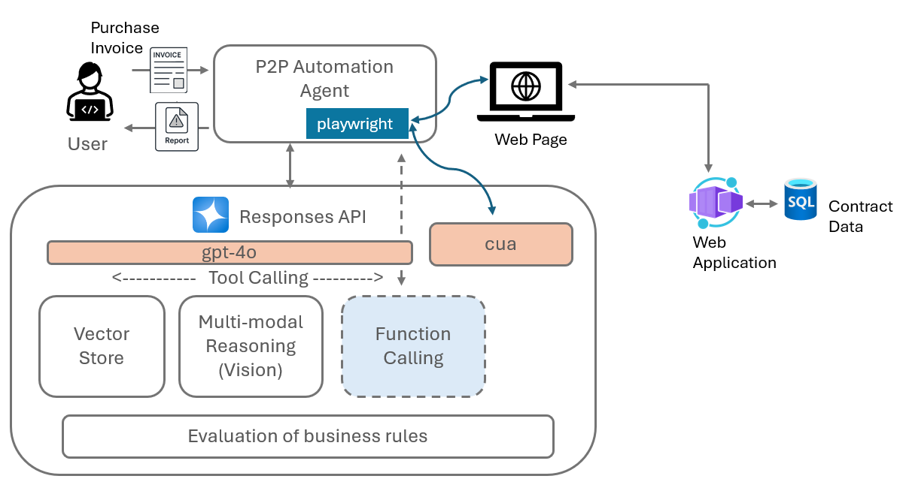
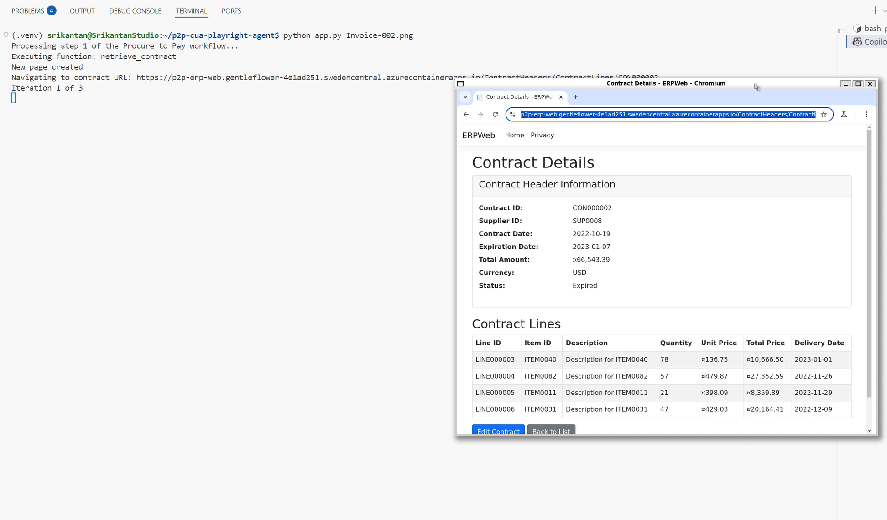
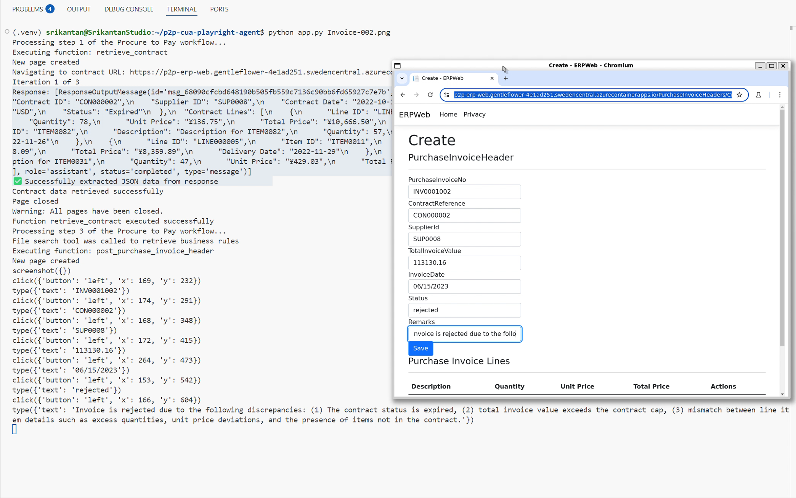

# Procure-to-Pay Automation with Azure OpenAI Computer Using Agent

## Foreword

In today's fast-paced business environment, procurement teams face numerous challenges including managing contracts, processing invoices, and ensuring compliance with business rules. This project showcases how we can leverage Azure OpenAI's Computer Using Agent capabilities to transform procurement processes through an innovative agentic solution.

### The Challenge

Procurement processes often involve:
- Manual data entry across multiple systems
- Time-consuming contract and invoice reviews
- Risk of human error in data extraction and entry
- Complex compliance requirements

### Agentic Approach to Procurement

Our solution harnesses Azure OpenAI's Computer Using Agent (CUA) technology and Responses API to create an AI assistant that can interact with procurement systems just like a human would - navigating web interfaces, extracting data from documents, and making informed decisions based on business rules.

This project specifically addresses scenarios where enterprises have legacy systems for which APIs are not available, and there are only web applications that let users perform their business functions. By using CUA, we can automate these processes without requiring API development or system modifications.

> **Note:** In the [TechCommunity blog](https://techcommunity.microsoft.com/blog/azure-ai-services-blog/agentic-p2p-automation-harnessing-the-power-of-openais-responses-api/4396741), I demonstrated how the same procure-to-pay automation can be accomplished using Azure OpenAI Responses API calling an API to retrieve contract information. This project takes that concept further by eliminating the need for APIs altogether.

---

A state-of-the-art solution that transforms procurement processes through Azure OpenAI's Computer Using Agent (CUA) capabilities, enabling automated invoice processing, anomaly detection, and compliance verification.



## Overview

This application leverages Azure OpenAI's Computer Using Agent (CUA) and Responses API to create an AI assistant that interacts with procurement systems just like a human would - navigating web interfaces, extracting data from invoices, and making informed decisions based on business rules. The solution streamlines invoice processing, contract verification, and anomaly detection in the procure-to-pay workflow.

### Key Features

- **Visual Document Understanding**: Extracts key data from invoice images
- **Interactive Web Navigation**: Interacts with procurement web interfaces
- **Business Rule Compliance**: Applies procurement policies to detect anomalies
- **Contract Verification**: Compares invoices against contracts to validate line items
- **Automated Data Entry**: Enters processed data into procurement systems

## Prerequisites

- Azure OpenAI access with Computer Using Agent (CUA) model enabled
- Python 3.9+ installed
- Azure subscription with:
  - Azure OpenAI Service
  - Azure SQL Database (for contract data and purchase invoice capture)

## Getting Started

### Setup Environment

1. Clone this repository:
```bash
git clone https://github.com/MSFT-Innovation-Hub-India/CUA-ProcureToPay-Automation-web
cd p2p-cua-playright-agent
```

2. Install required dependencies:
```bash
pip install -r requirements.txt
```

3. Install Playwright browsers:
```bash
python -m playwright install
```

4. Create a `.env` file with the following configuration:
```
AZURE_OPENAI_ENDPOINT=<your-azure-openai-endpoint>
MODEL_NAME=computer-use-preview
MODEL_NAME2=<your-responses-api-model>
AZURE_API_VERSION=<api-version>
contract_data_url=<url-to-contract-details-page>
invoice_data_url=<url-to-invoice-creation-page>
vector_store_id=<your-vector-store-id>
```

Note that the Web Application covered in this GitHub repository has to pre-exist before running this application:
[CUA-ProcureToPay-Automation-web](https://github.com/MSFT-Innovation-Hub-India/CUA-ProcureToPay-Automation-web)
Add the URLs for Contract data and Invoice data -> Master detail pages in the .env file above.

### Add Purchase Invoices

**Important**: Before running the application, the purchase invoice you want to process need to be stored as images in the `data_files` folder. The contract IDs referenced in these invoices must pre-exist in the Azure SQL database.

Sample invoices are provided in the repository:
- `data_files/Invoice-001.png`
- `data_files/Invoice-002.png`

**Note** In the next version of the Application, a Streamlit Web Application would be provided, allowing users to pick Invoice files from the file system.

### Run the Application

```bash
python app.py --image data_files/Invoice-002.png
```

You can specify a different invoice image using the `--image` parameter.

## How It Works

1. **Invoice Processing**:
   - The app extracts key data from invoice images using GPT-4o's vision capabilities
   - It identifies the associated contract number from the invoice
   
2. **Contract Retrieval**:
   - The CUA model navigates to the contract system to retrieve contract details
   - It extracts structured data about contract terms, line items, and pricing
   
   

3. **Business Rule Application**:
   - The system retrieves applicable business rules from the vector store
   - It applies these rules to compare invoice data against contract terms
   - Rules include price validation, quantity verification, and date checks

4. **Anomaly Detection**:
   - The system flags discrepancies like price mismatches or quantity issues
   - It determines if the invoice should be approved or rejected based on the findings

5. **Data Entry**:
   - The CUA model navigates the procurement system interface
   - It enters the processed invoice data and decision into the system
   - It handles any dialog boxes or confirmation messages
   
   

## Component Details

### Core Files

- `app.py`: Main application that orchestrates the entire workflow
- `call_computer_use.py`: Handles interactions with the CUA model
- `common/local_playwright.py`: Manages browser automation through Playwright
- `common/computer.py`: Base class for the Computer interface
- `data_files/p2p-rules.txt`: Business rules for anomaly detection
- `vector-store.py`: Manages vector embeddings for document retrieval

### Business Rules

The system enforces several procurement rules, including:

- Invoice date must be within the contract validity period
- Contract must be active and valid
- Invoice total must not exceed contract value
- Currencies must match between invoice and contract
- Line item quantities must not exceed contract quantities
- Line item prices must match contract prices

## Architecture

The solution leverages several Azure services:

- **Azure OpenAI Service**: Powers the AI models for understanding and decision-making
  - Computer Using Agent (CUA) model: Enables interface interaction
  - Responses API: Orchestrates the workflow
  - GPT-4o: Processes invoice images with vision capabilities
  - Vector store for business rules and documents
- **Azure Container Apps**: Hosts the procurement web application
- **Azure SQL Database**: Stores contract and procurement data


## Related Article

Refer to the linkedin article [here](https://www.linkedin.com/pulse/beyond-automation-how-computer-using-agent-transforms-sankaran-d1wic/) for a description of the use case this sample application helps solve and how it works.


## Demonstration

Watch this video demonstration to see the application in action:

<div align="center">
  <a href="https://www.youtube.com/watch?v=ZmjL-eTbago">
    
  </a>
</div>